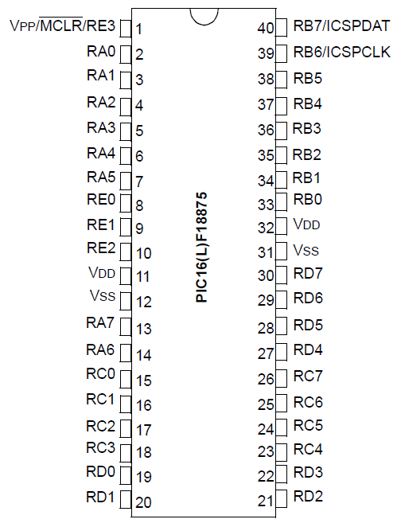

# project_mchp

A Microchip project demo ;-)

## Description

Demo on Microchip environment with the PIC16F18875 microcontroller.

## Demo MPLAB X IDE

- [x] Create a blank project
- [x] Open MCC plugin
- [x] Choose all peripherals you want to use
- [ ] Clic on **Generate code**

## Development tools used

* [MPLAB® X Integrated Development Environment (IDE) and tools](http://www.microchip.com/mplab/mplab-x-ide) - v5.30
* [MPLAB® XC8 Compiler](http://www.microchip.com/mplab/compilers) - v2.10
* [MPLAB® Code Configurator](http://www.microchip.com/mplab/mplab-code-configurator)
* [PICkit(TM) 3 In-Circuit Debugger](http://www.microchip.com/Developmenttools/ProductDetails.aspx?PartNO=PG164130)

## Datasheet

* [DS40001802G_PIC16F18855-75.pdf](http://ww1.microchip.com/downloads/en/DeviceDoc/40001802G.pdf)
* [Microchip sent me a free unit of their Curiosity HPC development board](https://www.teachmemicro.com/first-use-microchip-curiosity-hpc/)
* [8-Bit Interrupt On Change](https://microchipdeveloper.com/projects:mcu1101-project-9)

---

### Pin Mapping

| I/O PIN | Hardware function    |
| :-----: | -------------------- |
|   RA0   | LED                  |
|   RA5   | pushButton           |
|   RA6   | CKLOUT               |
|   RC0   | TX to RXD computer   |
|   RC1   | RX from TXD computer |

#### PIC16F18875 pinout

Measuring on RA6 de CKLOUT = 1 MHz et 0 Hz in Sleep mode.
